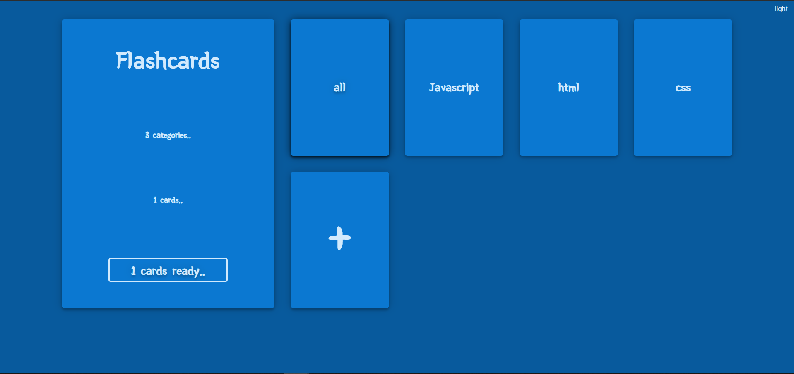

# piscine_JS # flashcards

A simple javascript flashcards tool..

Learnings :
- cookies
- localStorage
- modules
- jquery
- css grid template
- Create Read Update Delete data
- Dark/light theme
- css design

